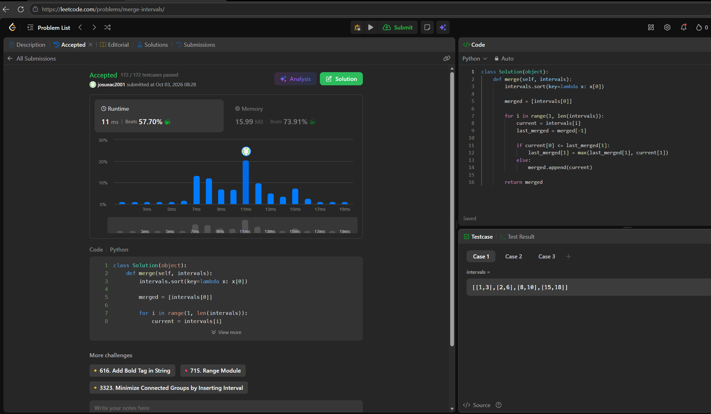

## 56. Merge Intervals

https://leetcode.com/problems/merge-intervals/

Familia: ordenamiento  
Idea: Se ordena el arreglo utilizando como clave el extremo izquierdo del intervalo. Luego se recorre linealmente manteniendo el último intervalo abierto: si el inicio del intervalo actual es menor o igual al fin del abierto, se solapan y se ensancha el límite derecho. si no, se guarda y se abre uno nuevo.  
Complejidad: Tiempo O(n \log n) dominado estrictamente por el ordenamiento inicial, donde $n$ es la cantidad de intervalos. Espacio O(n) extra necesario para la lista de salida que almacena los intervalos fusionados (y el espacio de la pila recursiva del sort).

