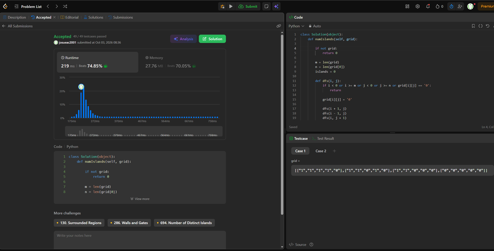
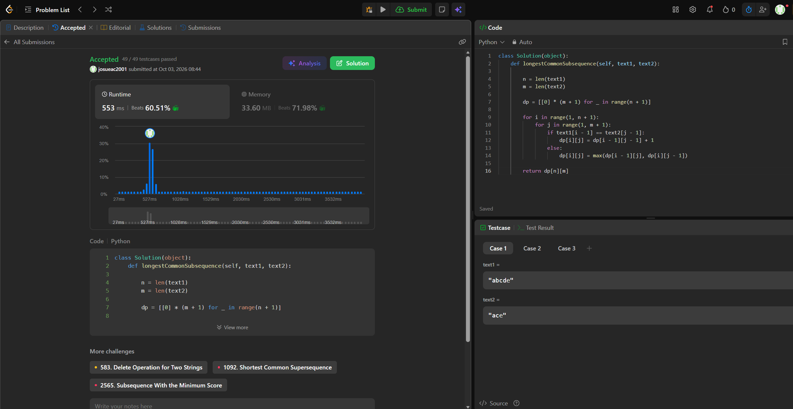

## 56. Merge Intervals

https://leetcode.com/problems/merge-intervals/

Familia: ordenamiento  
Idea: Se ordena el arreglo utilizando como clave el extremo izquierdo del intervalo. Luego se recorre linealmente manteniendo el último intervalo abierto: si el inicio del intervalo actual es menor o igual al fin del abierto, se solapan y se ensancha el límite derecho. si no, se guarda y se abre uno nuevo.  
Complejidad: Tiempo O(n \log n) dominado estrictamente por el ordenamiento inicial, donde $n$ es la cantidad de intervalos. Espacio O(n) extra necesario para la lista de salida que almacena los intervalos fusionados (y el espacio de la pila recursiva del sort).

## 200. Number of Islands

https://leetcode.com/problems/number-of-islands/

Familia: grafos  
Idea: Se modela la grilla como un grafo no dirigido donde cada celda 1 es un vértice y existe una arista si dos unos son vecinos ortogonales, por lo que contar islas equivale a contar componentes conexas. Al encontrar un 1, se suma al contador y se lanza una búsqueda en profundidad para marcar todo su componente y evitar contarla de nuevo.  
Complejidad: Tiempo $\Theta(m \cdot n)$ donde m son las filas y n las columnas, ya que la matriz completa se escanea una vez y el DFS visita cada celda a lo sumo una vez. Espacio $O(m \cdot n)$ en el peor caso requerido por la pila de llamadas recursivas.

## 1143. Longest Common Subsequence

https://leetcode.com/problems/longest-common-subsequence/

Familia: programación dinámica  
Idea: El estado dp[i][j] almacena la longitud de la subsecuencia común más larga para los prefijos `text1[0..i)` y `text2[0..j)`. El caso base es 0 para cualquier prefijo vacío, y la recurrencia suma 1 a la diagonal si los caracteres coinciden (`dp[i-1][j-1] + 1`), o toma el máximo entre la celda de arriba y la de la izquierda (`max(dp[i-1][j], dp[i][j-1])`) si son diferentes.  
Complejidad: Tiempo $\Theta(n \cdot m)$ y Espacio $\Theta(n \cdot m)$, donde n y m son las longitudes de las cadenas text1 y text2 respectivamente, ya que se tabulan los resultados en una matriz de esas dimensiones.

