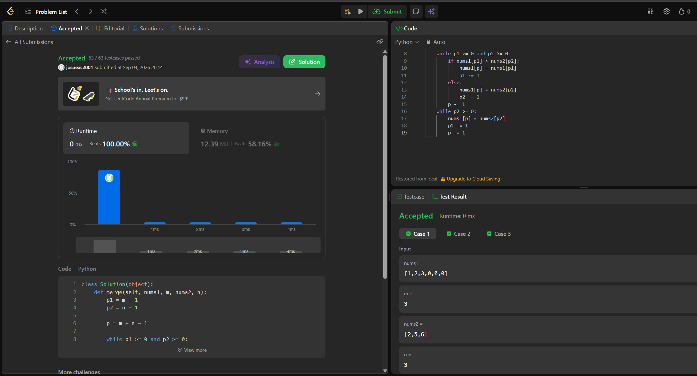
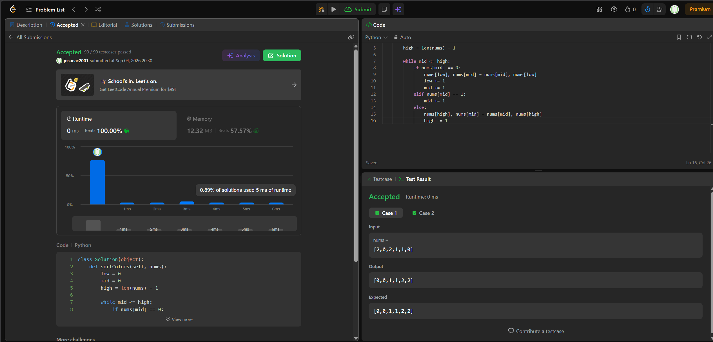

## 88. Merge Sorted Array

https://leetcode.com/problems/merge-sorted-array/description/

Estrategia (Two Pointers in-place): Como nums1 tiene espacio vacío al final, utilizamos dos punteros empezando desde el final de ambos arreglos válidos. Comparamos los últimos elementos de nums1 y nums2, colocando el mayor en la última posición disponible de nums1. Se escribe de atrás hacia adelante para no sobreescribir los valores originales de nums1 que aún no han sido procesados.

Complejidad:
Tiempo: O(m + n), ya que en el peor de los casos se recorren todos los elementos de ambos arreglos una sola vez. Se cumple el requisito (Follow up) de LeetCode.
Espacio: O(1) auxiliar, porque se modifica nums1 directamente sin crear arreglos adicionales.

## 75. Sort Colors

https://leetcode.com/problems/sort-colors/description/

Estrategia: Se optó por la solución de una sola pasada utilizando el enfoque de tres punteros (low, mid, high). A medida que el puntero "mid" recorre el arreglo, envía los elementos 0 hacia el inicio intercambiándolos con "low" y los elementos 2 hacia el final intercambiándolos con "high". Los 1 simplemente se dejan en el centro.
Este algoritmo logra un tiempo lineal porque NO es un ordenamiento basado en comparaciones entre elementos, sino que aprovecha que el universo de claves es minúsculo y conocido, evadiendo así la parte teórica de Ω(n log n).

Complejidad:
Tiempo: O(N), El arreglo se recorre exactamente una vez en un solo bucle while, el puntero mid avanza o el high retrocede en cada paso hasta encontrarse.
Espacio: O(1) extra, ya que los intercambios se hacen in-place usando solo tres variables de estado.

