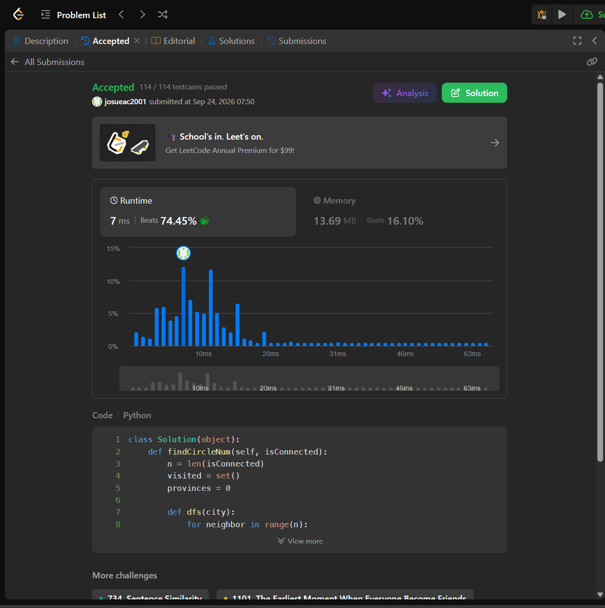

## 547. Number of Provinces

https://leetcode.com/problems/number-of-provinces/description/

Estrategia (Depth-First Search): El problema consiste en hallar el número de componentes conexas del grafo. Se itera linealmente sobre las $n$ ciudades; cada vez que se encuentra una ciudad no visitada, se incrementa el contador de provincias y se lanza un recorrido DFS. El DFS explora la fila de la matriz correspondiente a esa ciudad y marca como visitados a todos sus vecinos directos e indirectos, garantizando que el ciclo principal no los vuelva a contar como provincias nuevas.

Complejidad:
Tiempo: Θ(n²). Aunque un DFS teóricamente cuesta O(V + E), aquí la entrada está dada como una matriz de adyacencia de n × n. Para encontrar los vecinos de cada vértice, el algoritmo está obligado a recorrer su fila completa, por lo que se deben inspeccionar obligatoriamente las n² celdas de la matriz.
Espacio: O(n). Se requiere espacio adicional para el conjunto de ciudades visitadas (tamaño n) y para la pila de llamadas del sistema por la recursividad del DFS, que en el peor de los casos (todas las ciudades conectadas en línea) alcanzará una profundidad de n.

