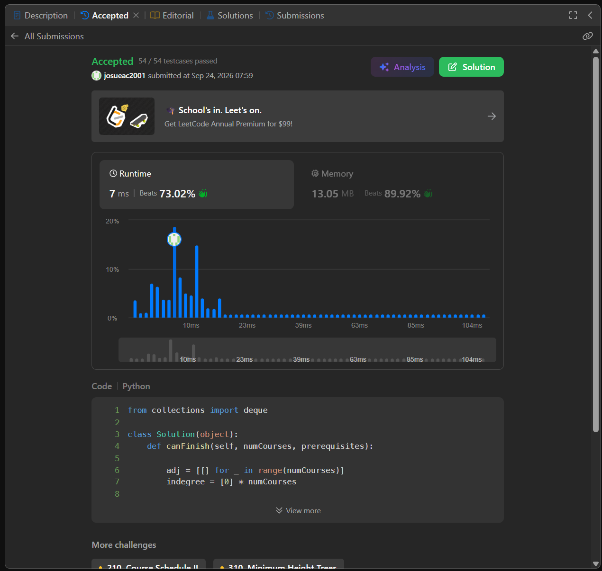

## 547. Number of Provinces

https://leetcode.com/problems/number-of-provinces/description/

Estrategia (Depth-First Search): El problema consiste en hallar el número de componentes conexas del grafo. Se itera linealmente sobre las $n$ ciudades; cada vez que se encuentra una ciudad no visitada, se incrementa el contador de provincias y se lanza un recorrido DFS. El DFS explora la fila de la matriz correspondiente a esa ciudad y marca como visitados a todos sus vecinos directos e indirectos, garantizando que el ciclo principal no los vuelva a contar como provincias nuevas.

Complejidad:
Tiempo: Θ(n²). Aunque un DFS teóricamente cuesta O(V + E), aquí la entrada está dada como una matriz de adyacencia de n × n. Para encontrar los vecinos de cada vértice, el algoritmo está obligado a recorrer su fila completa, por lo que se deben inspeccionar obligatoriamente las n² celdas de la matriz.
Espacio: O(n). Se requiere espacio adicional para el conjunto de ciudades visitadas y para la pila de llamadas del sistema por la recursividad del DFS, que en el peor de los casos alcanzará una profundidad de n.

## 207. Course Schedule

https://leetcode.com/problems/course-schedule/description/

Estrategia (Algoritmo de Kahn): Se modela el problema como un grafo dirigido donde cada materia es un vértice y una dependencia [a, b] es un arco dirigido b → a. Utilizamos el algoritmo de Kahn construyendo primero la lista de adyacencia y un arreglo de grados de entrada que cuenta los prerrequisitos pendientes de cada materia. Encolamos las materias con indegree 0 y, a medida que las cursamos, reducimos el indegree de sus vecinas. Si una vecina llega a 0, se encola. Al final, si el recuento de materias cursadas es menor a numCourses, significa que existe un ciclo y es imposible terminar la carrera.

Complejidad:
Tiempo: O(n + m), donde n es numCourses (vértices) y m es la cantidad de prerrequisitos (aristas). Se recorren todos los pares una vez para construir el grafo y cada nodo/arista se encola y procesa como máximo una vez. 
Espacio: O(n + m), ya que se requiere memoria adicional para almacenar la lista de adyacencia que contendrá las m aristas, además del arreglo de indegree y la cola de procesamiento que escalan en función de los n nodos.

