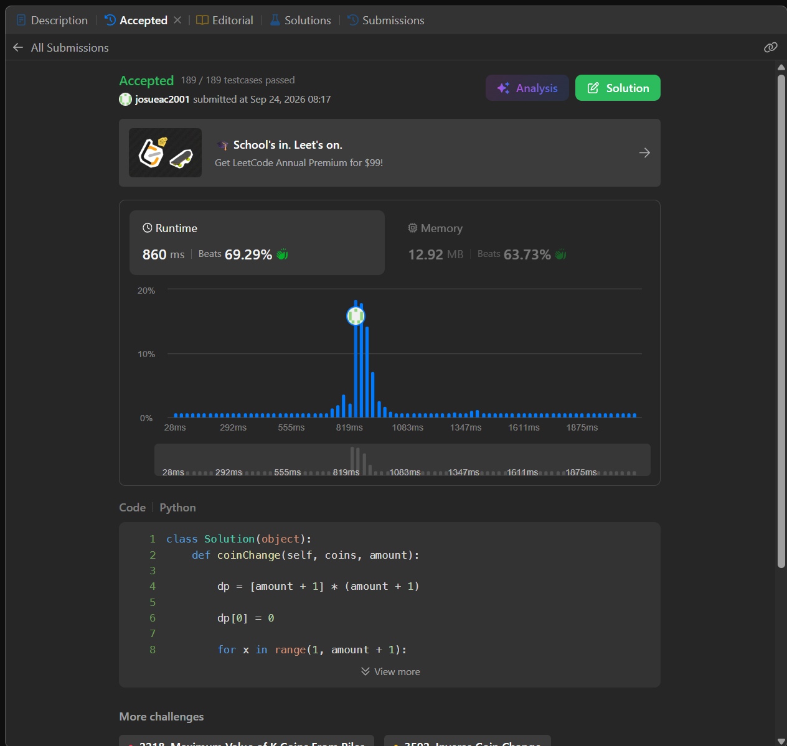

## 322. Coin Change

https://leetcode.com/problems/coin-change/description/

Estrategia (Tabulación): Como el sistema de monedas no necesariamente es canónico, Se utiliza Programación Dinámica tabulando los resultados en un arreglo dp, donde dp[x] representa el mínimo de monedas para alcanzar el monto x. Para cada monto, se prueba cada moneda disponible y se actualiza el estado mediante la recurrencia dp[x] = min(dp[x], 1 + dp[x - c]).

Complejidad:
Tiempo: Θ(k · X), donde k es la cantidad de tipos de monedas y X es el monto. Por cada monto desde 1 hasta X, se itera sobre las k monedas. Esta complejidad es pseudo polinomial, ya que depende del valor numérico del monto y no de la longitud de su representación en bits.
Espacio: Θ(X), debido al almacenamiento del arreglo unidimensional dp de tamaño amount + 1.

