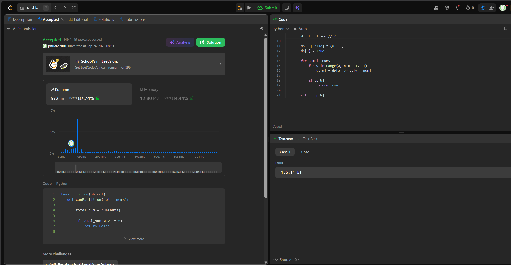

## 322. Coin Change

https://leetcode.com/problems/coin-change/description/

Estrategia (Tabulación): Como el sistema de monedas no necesariamente es canónico, Se utiliza Programación Dinámica tabulando los resultados en un arreglo dp, donde dp[x] representa el mínimo de monedas para alcanzar el monto x. Para cada monto, se prueba cada moneda disponible y se actualiza el estado mediante la recurrencia dp[x] = min(dp[x], 1 + dp[x - c]).

Complejidad:
Tiempo: Θ(k · X), donde k es la cantidad de tipos de monedas y X es el monto. Por cada monto desde 1 hasta X, se itera sobre las k monedas. Esta complejidad es pseudo polinomial, ya que depende del valor numérico del monto y no de la longitud de su representación en bits.
Espacio: Θ(X), debido al almacenamiento del arreglo unidimensional dp de tamaño amount + 1.

## 416. Partition Equal Subset Sum

https://leetcode.com/problems/partition-equal-subset-sum/description/

Estrategia (Programación Dinámica): Este problema es equivalente a buscar si existe un subconjunto donde S es la suma de todo el arreglo. Si S es impar, es trivialmente falso. Se modela como una mochila utilizando un arreglo 1D para tabular los estados. Para garantizar que cada número se use a lo sumo una vez, al evaluar un nuevo elemento se recorren los pesos de manera descendente. Una iteración ascendente convertiría el algoritmo en una mochila no acotada.

Complejidad:
Tiempo: Θ(n · W), donde n es la cantidad de elementos en nums y W es S/2 (la mitad de la suma total). Por cada uno de los n elementos, se hace un barrido sobre el arreglo de tamaño W. Es una complejidad pseudo polinomial dependiente del valor numérico de las entradas, no estrictamente O(n²).
Espacio: Θ(W), extra requerido por el arreglo 1D (dp) de tamaño W + 1 utilizado para almacenar la alcanzabilidad de cada suma.

